# Real-Time Endoscopic Tool Detection

A surgical-tool detector for endoscopic video, taken from dataset to an edge-style deployment. It uses YOLO11n on Kvasir-Instrument, validated with 5-fold cross-validation and a cross-dataset test. The model is exported to TensorRT and wired into a Qt live panel, which drives a C++ UART relay to a simulated microcontroller.

<p align="center">
  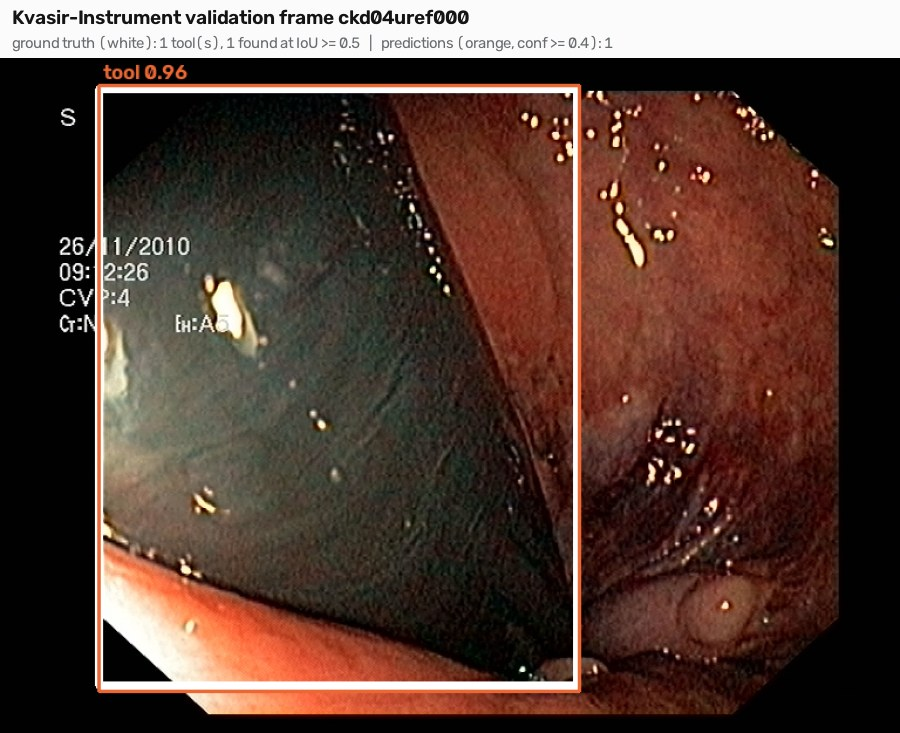
  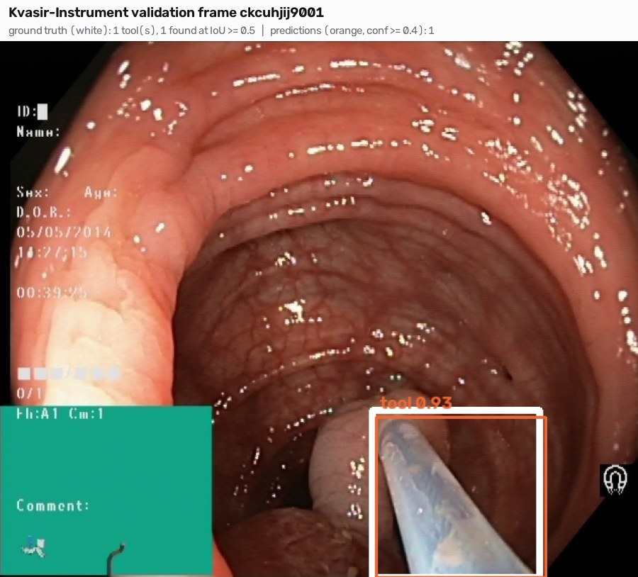
</p>
<p align="center"><sub>Held-out validation frames. White: ground truth. Orange: YOLO11n predictions at the GUI's 0.4 threshold.</sub></p>

## Highlights

| | |
|---|---|
| **In-domain accuracy** | mAP50 **0.937** on the held-out split · **0.963 ± 0.034** across 5 folds |
| **Generalisation test** | mAP50 **0.167** on laparoscopic video (m2cai16) without retraining, which exposes the domain gap |
| **Inference latency** | TensorRT engine: mean **0.87 ms**, p99 **1.03 ms** per 640×640 frame on an RTX 5080 (3,451 runs) |
| **System** | PySide6 panel → status file → C++17 `termios` relay (`$STATE*\n` frames, 115200 8N1) → simulated MCU over a `socat` serial pair |
| **Process** | Requirements and a test plan with recorded pass / partial / open results ([docs/](docs/test_plan.md)) |

The full walkthrough, with code and rendered results, is in **[endoscopic_tool_detection.ipynb](endoscopic_tool_detection.ipynb)**.

## Results

### Detection quality

| Model (60 epochs, 640 px) | Precision | Recall | mAP50 | mAP50-95 |
|---|---|---|---|---|
| **YOLO11n** (final) | 0.974 | 0.879 | **0.937** | 0.804 |
| YOLOv8n (baseline) | 0.912 | 0.923 | 0.929 | 0.818 |
| YOLO11n, 5-fold CV (mean ± std) | 0.966 ± 0.029 | 0.932 ± 0.051 | **0.963 ± 0.034** | 0.856 ± 0.039 |

<p align="center">
  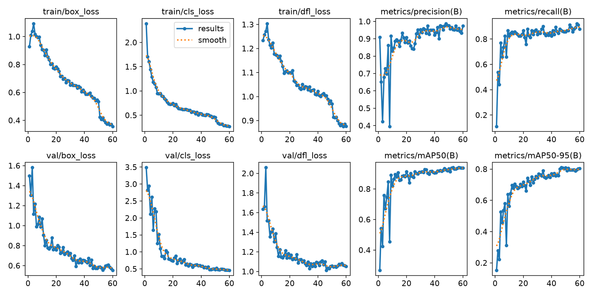
  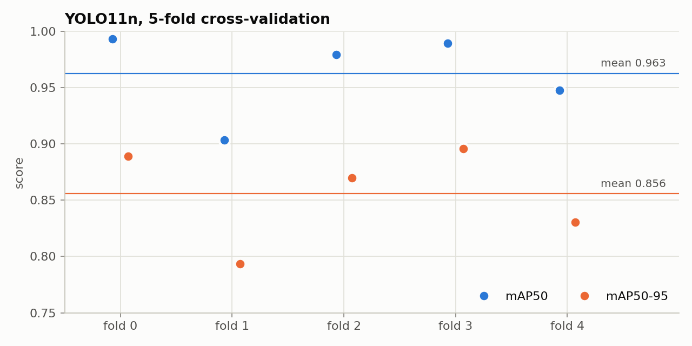
</p>

### Cross-dataset test: GI endoscopy → laparoscopic surgery

The Kvasir-trained model was evaluated unchanged on 2,811 laparoscopic cholecystectomy frames (3,929 boxes, 7 tool classes merged into one). mAP50 drops from 0.96 to **0.17**. The in-domain score therefore does not transfer to a new procedure, and mixed-domain training is the next experiment. In three random frames, the model finds 2 of the 5 instruments:

<p align="center">
  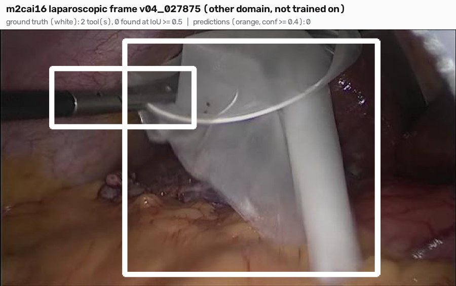
  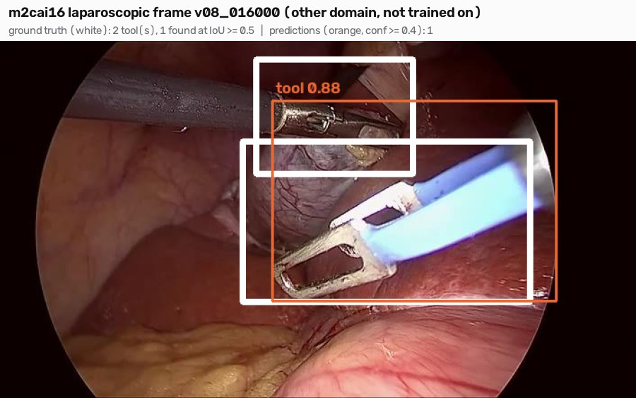
</p>
<p align="center">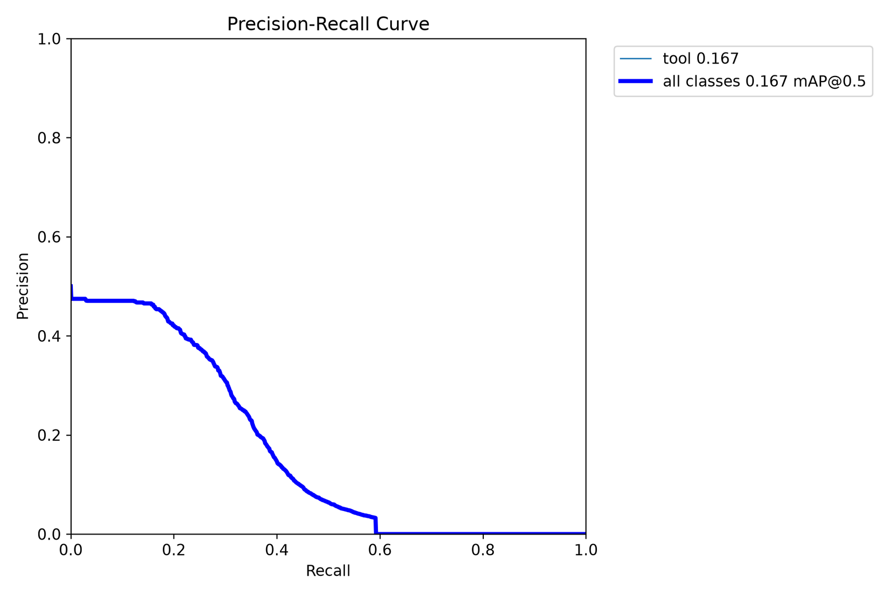</p>

### Latency and failure cases

<p align="center">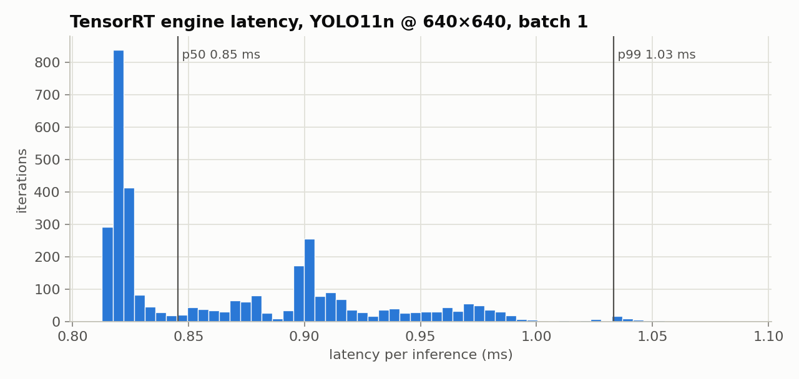</p>

The engine is compiled from the FP32 ONNX export. TensorRT 11 builds strongly-typed networks, so it runs in FP32, and an FP16 export is the next optimisation.

The least-confident validation frames, one image each:

<p align="center">
  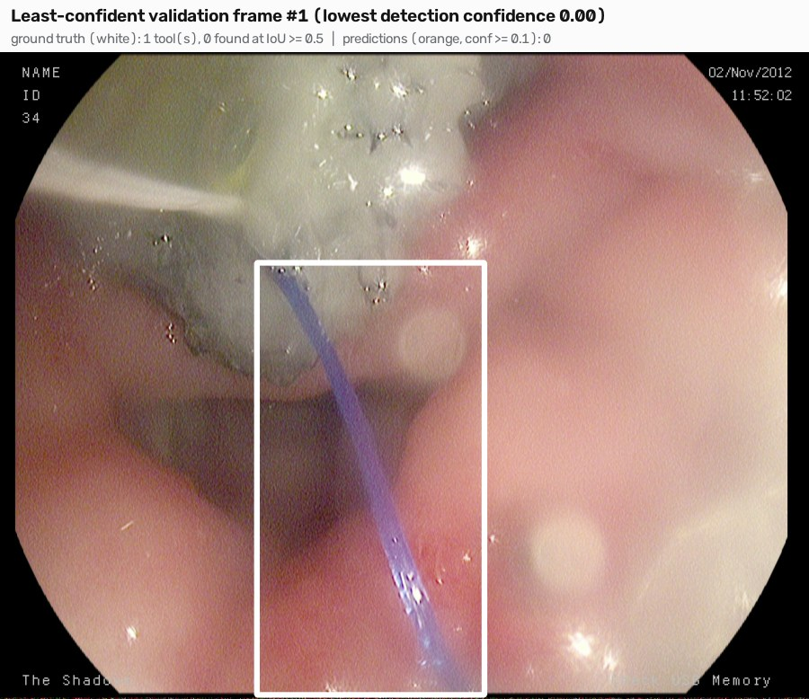
  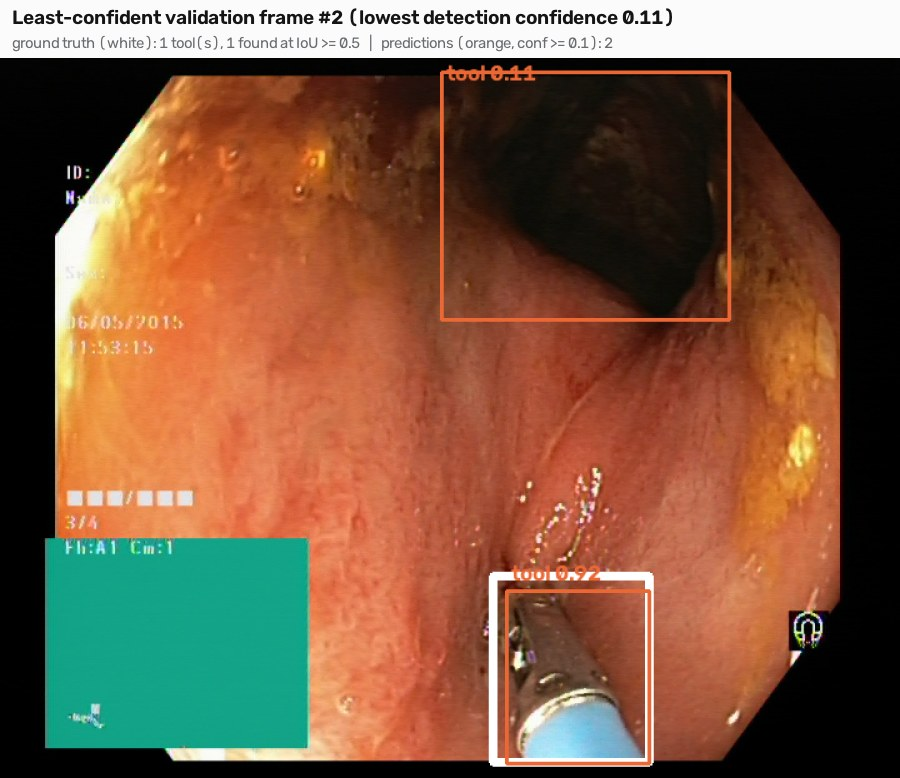
</p>

- **Missed.** A thin guidewire in an over-exposed view gets no detection at all.
- **Extra box.** The tool is found at 0.92, but a second box at 0.11 lands on the dark lumen.
- **Low confidence.** In the third frame ([failure_3.jpg](results/examples/failure_3.jpg)), the tool is found only at 0.13, below the GUI's 0.4 threshold.

## How it works

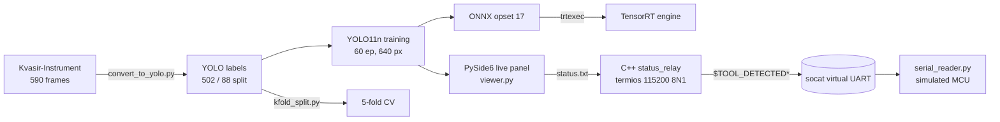

## Repository layout

```
endoscopic_tool_detection.ipynb   end-to-end notebook (code + results)
src/data_prep/                    Kvasir → YOLO, k-fold split / training, m2cai16 → YOLO
src/analysis/                     failure gallery, per-case example renderer, trtexec latency percentile report
src/gui/viewer.py                 PySide6 live panel (writes status.txt)
src/uart_sim/                     Python serial relay + simulated microcontroller
cpp/status_relay/                 C++17 POSIX-termios serial relay (CMake)
docs/                             requirements and verification test plan
results/examples/                 one image per case: in-domain, cross-dataset and failure frames with ground truth
results/figures/                  training curves, PR curves, k-fold and latency charts
results/metrics/                  training logs, k-fold results, TensorRT per-run timings
```

## Quick start

```bash
pip install -r requirements.txt

# 1. data: Kvasir-Instrument (https://datasets.simula.no/kvasir-instrument/) -> data/raw
python src/data_prep/convert_to_yolo.py --src data/raw/kvasir-instrument --dst data/yolo

# 2. train + export
yolo detect train data=data/yolo/data.yaml model=yolo11n.pt epochs=60 imgsz=640 batch=16 device=0
yolo export model=runs/detect/train/weights/best.pt format=onnx opset=17 simplify=True
trtexec --onnx=runs/detect/train/weights/best.onnx --saveEngine=tool_detector.engine

# 3. live demo with a virtual serial link
cmake -S cpp/status_relay -B cpp/status_relay/build && cmake --build cpp/status_relay/build
socat -d -d pty,raw,echo=0 pty,raw,echo=0          # note the two /dev/pts/N paths
python src/gui/viewer.py data/yolo/images/val runs/detect/train/weights/best.pt status.txt
./cpp/status_relay/build/status_relay status.txt /dev/pts/<A>
python src/uart_sim/serial_reader.py /dev/pts/<B>
```

## Limitations and next steps

- Performance is **in-domain only**, as the cross-dataset mAP50 of 0.17 shows. Next: train on Kvasir plus m2cai16, then re-test on an unseen procedure.
- The engine is FP32. Next: FP16 or INT8 (calibrated) export, and serving the TensorRT engine from the GUI instead of the PyTorch model.
- End-to-end latency (camera → UART byte) and the timestamped event log (REQ-05) are still open in the [test plan](docs/test_plan.md).

## Data & licenses

- **Kvasir-Instrument**: Jha et al., *Kvasir-Instrument: Diagnostic and therapeutic tool segmentation dataset in gastrointestinal endoscopy*, MMM 2021. [Dataset page](https://datasets.simula.no/kvasir-instrument/).
- **m2cai16-tool-locations**: Jin et al., *Tool Detection and Operative Skill Assessment in Surgical Videos Using Region-Based CNNs*, WACV 2018.
- Datasets and weights are not redistributed here. Sample images in `results/` are model outputs on dataset frames, shown for illustration under the datasets' terms.
- **Ultralytics YOLO / RT-DETR** is used as a dependency under AGPL-3.0.
- Code: MIT (see [LICENSE](LICENSE)).
